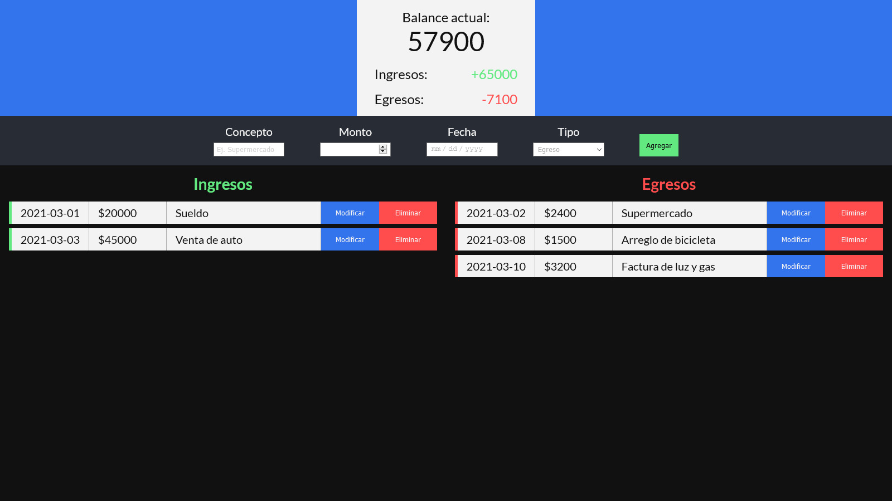

# Alkemy Challenge (Frontend)

## Back end
- [Repo](https://github.com/morrisdavidcardenas/alkemy-backend)

## Preview 


## Technologies

- HTML
- CSS
- JS
- React

## Requirements
- [Node](https://nodejs.org/en/download/)

## Install

```
git clone https://github.com/morrisdavidcardenas/alkemy.git

cd alkemy-challenge

npm install

npm start
```

## Status

Project is: Done
